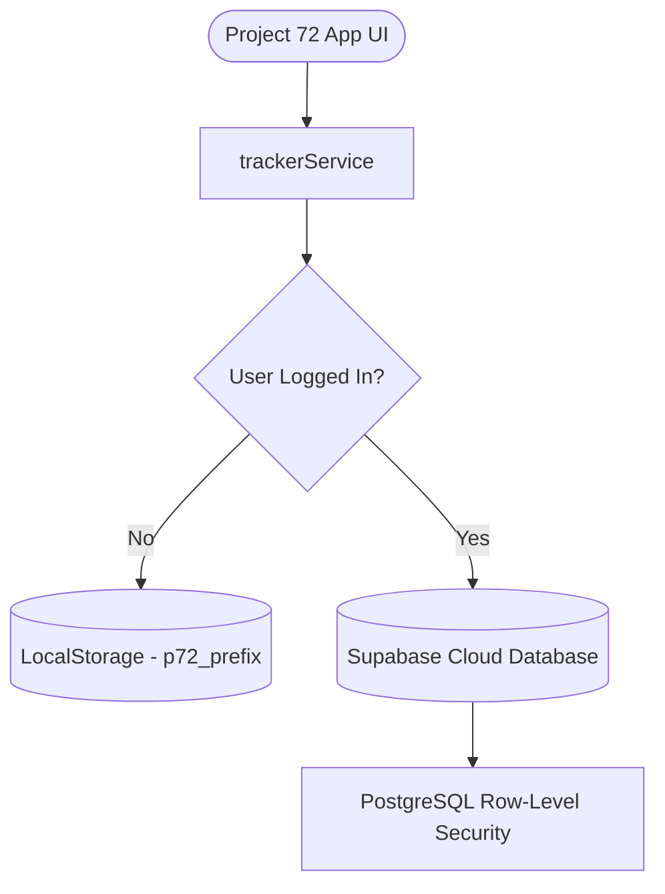

# <p align="center"><br>Project 72 — Health & Weight Loss OS</p>

<p align="center">
  
  
  
  
  
</p>

---

## 🌟 Introduction

**Project 72** is a premium, state-of-the-art **Health & Weight Loss Operating System (OS)**. Designed as a comprehensive, unified portal for fitness trackers, it is calibrated for individuals working towards a target body weight of **72kg**. 

Unlike standard trackers, Project 72 incorporates a **local-first hybrid database flow** that stores details offline in `LocalStorage` and instantly upgrades to cloud synchronization via **Supabase** upon login. Empowered by **Google Gemini AI**, the application analyzes your tracking consistency, formulates nutrition adjustments, generates customized workout routines, and acts as your personal digital strength coach.

---

## 🚀 Key Features

### 🧠 1. AI Coaching & Recommendation Engine
*   **AI Daily Coach**: Dynamically evaluates your routine and displays a recommended split (exercises, sets, reps, notes) and conditioning plan on your dashboard.
*   **AI Workout Planner**: Formulates tailored weekly splits based on training experience, available equipment (Home vs. Gym), schedule limits, target muscle groups, and physical injuries.
*   **AI Meal Planner**: Generates daily high-protein nutritional splits matching your target calories, dietary restrictions, and food favorites.
*   **AI Performance Analysis**: Analyzes workout progression trends over time to identify strength gains, plateaus, and output metrics.
*   **AI Weekly Review**: Automatically consolidates daily logs (adherence, calorie/protein targets, sleep, weight change) every week, outputting highlights, lowlights, and next-week actionable guidelines.

### 📊 2. Comprehensive Tracking Suite
*   **Advanced Dashboard**: Features time-based greetings, a dynamic BMI scale, 30-day weight moving average (7-day MA overlay), and daily target compliance rings.
*   **Nutrition Tracker**: Log breakfasts, lunches, dinners, and snacks with a built-in pre-loaded nutrition food database (Chicken breast, Eggs, Paneer, oats, Idli, Dosa, etc.).
*   **Workout & Cardio Logging**: Log weightlifting sessions (sets × reps × weight) or cardio events (walking, running, cycling, swimming, stair climbing) with duration, distance, and heart rate zones.
*   **Daily Habits Checklists**: Build streaks for essential habits (10k steps, water intake, sleep, mobility exercises) that dynamically compute a daily **Compliance Score (0-100)**.
*   **Biomarkers & Health Metrics**: Log resting heart rate, blood pressure, fasting glucose, HbA1c, Vitamin D/B12 levels, and body measurements (waist, hips, chest, biceps).

### 🏆 3. Gamification & Analytics
*   **Interactive Charts**: Beautiful, smooth charts built with **Recharts** displaying weight loss trajectories, calorie/macronutrient logs, steps, and sleep trends.
*   **Milestones Trophy Cabinet**: A gamified badge system celebrating goals like *"First 1kg Lost"*, *"7-Day Habit Streak"*, *"50k Total Steps"*, and the ultimate *"Target 72kg Reached"*.
*   **Tracking Calendar**: Visually examine historical days to review past nutritional details, workout routines, and compliance indexes.

---

## 🛠️ Tech Stack & Architecture

Project 72 is engineered with premium modern technologies for a fluid, glassmorphic dark-themed user interface:

| Category | Technology | Purpose & Implementation |
| :--- | :--- | :--- |
| **Frontend Framework** | Next.js 16 (App Router) & React 19 | High-performance routing, Server/Client component hybrid rendering. |
| **Database & Auth** | Supabase (Postgres) | Real-time database sync, Row-Level Security (RLS) policies, and user auth. |
| **State Management** | Zustand | Global client-side state for theme toggle, date selection, and sidebar layout. |
| **Data Fetching** | TanStack React Query v5 | Auto-caching, smooth mutations, and query invalidation. |
| **Styling** | Tailwind CSS v4 & Radix UI | Modern variables utility styling, sleek glassmorphism, responsive designs. |
| **Animations** | Framer Motion | Smooth component entries, sidebar transitions, and modal slides. |
| **Visualizations** | Recharts | Renders weight moving averages, correlation analytics, and intake trends. |
| **AI Integration** | Gemini Developer API | Generates structural workout structures, nutrition guides, and text insights. |

### Database Architecture: Local-First Hybrid Sync


---

## 📦 Getting Started

### Prerequisites
*   Node.js (v18.x or later)
*   A Supabase project (Free Tier)
*   A Gemini API Key (or OpenRouter credential)

### Installation

1.  **Clone the Repository**:
    ```bash
    git clone https://github.com/ArjunCherukuri10/Project-72.git
    cd Project-72
    ```

2.  **Install Dependencies**:
    ```bash
    npm install
    ```

3.  **Environment Variables**:
    Create a `.env.local` file in the root directory and append your keys:
    ```env
    # Supabase Configuration
    NEXT_PUBLIC_SUPABASE_URL=https://your-project-id.supabase.co
    NEXT_PUBLIC_SUPABASE_ANON_KEY=your-supabase-anon-key

    # Gemini AI Configuration (Supports direct Gemini keys or OpenRouter keys starting with sk-or-)
    GEMINI_API_KEY=your_gemini_api_key_here
    ```

4.  **Database Migration**:
    Initialize the PostgreSQL tables by executing the migrations against your Supabase project. The migrations are located in `supabase/migrations/`.
    
    If using the Supabase CLI, link your project and apply the schema:
    ```bash
    supabase login
    supabase link --project-ref your-project-id
    supabase db push
    ```
    *Alternatively, you can copy the contents of the files in `supabase/migrations/` and execute them sequentially in the Supabase SQL Editor:*
    1.  `20260608000000_init_schema.sql`
    2.  `20260608000100_v2_updates.sql`
    3.  `20260608000200_fix_policies_and_missing_tables.sql`
    4.  `20260608000300_update_weekly_reviews_columns.sql`
    5.  `20260608000400_add_onboarding_fields_to_profiles.sql`

5.  **Start the Local Server**:
    ```bash
    npm run dev
    ```
    Open `http://localhost:3000` on your browser to access the Health OS.

---

## 🧠 AI Endpoint Structure

The project maps standard POST requests into Gemini APIs to return structured, typed JSON responses:

*   `/api/ai-workout`: Generates full weekly split JSON objects matching user experience, equipment, and injuries.
*   `/api/ai-cardio`: Generates progressive heart-rate-zone targets.
*   `/api/ai-meal`: Designs customized daily high-protein nutritional plans.
*   `/api/ai-workout-analysis`: Analyzes resistance training metrics and strength indicators.
*   `/api/ai-review`: Compiles weekly metrics into positive highlights, negative lowlights, and guidelines.

---

## 📂 Project Structure

```
├── public/                 # Static assets (logo, SVG graphics)
├── supabase/               # DB migrations & schema setup
├── src/
│   ├── app/                # App Router Routes & Pages
│   │   ├── analytics/      # Analytical dashboards & charts
│   │   ├── api/            # Next.js API Routes (Gemini integrations)
│   │   ├── calendar/       # Day-by-day logs inspector
│   │   ├── cardio/         # Heart-rate conditioning plans
│   │   ├── food/           # Custom food items catalog
│   │   ├── goals/          # Custom task goals
│   │   ├── habits/         # Streak checklists
│   │   ├── health/         # Biomarkers & biomarker logs
│   │   ├── measurements/   # Body tape-measure stats
│   │   ├── milestones/     # Gamified achievements
│   │   ├── nutrition/      # Meal tracker & AI meal planner
│   │   ├── reviews/        # AI Weekly review generator
│   │   ├── settings/       # Demo logs & unit toggles
│   │   └── page.tsx        # Core OS dashboard
│   ├── components/         # Reusable UI component modules
│   ├── lib/                # Utility helpers & API services
│   ├── providers/          # Theme & TanStack Query wrappers
│   ├── stores/             # Zustand state stores
│   └── types/              # TypeScript types & database schemas
```

---

## 🏆 Project 72 Philosophy

The number **72** is more than just a weight goal; it represents the mathematical sweet spot where strength-to-weight ratio, cardiovascular endurance, and biomarker levels align to deliver peak physical efficiency. Project 72 is built to make that transition structured, measurable, and intelligent.
